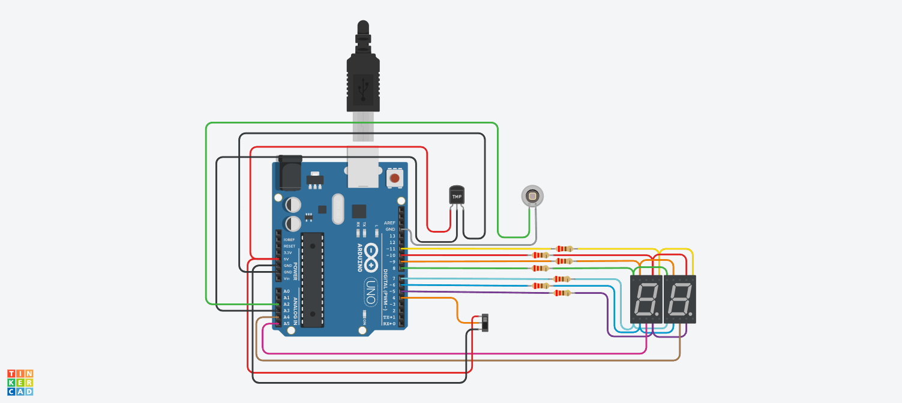

# PARCIAL SPD

## AUTOR 
- FACUNDO VILLOLDO YEGROS 1-B

## Proyecto: Contador binario.

## Descripción

modificar la lógica del programa según numero de DNI. Mi caso cambiar lo que muestra el display de numeros primos a numeros impares.

## Modificación

La modificación que me tocó hacer es reemplazar los numeros primos que muestra el display a números impares.

## Función principal
En la función loop dependiendo el slide se muestran los número impares o el contador.

En la Segunda función es donde se calculan los numeros impares. Los numero son divididos por dos y el operador % calcula el resto. En caso de que el resto
sea diferente 0 la función retorna un el valor booleano true. En la función loop se muestran los números impares.

~~~C
void loop()
{
  int luzAmbiental = analogRead(PHOTO);
  Serial.println("La luz ambiental es:");
  Serial.println(luzAmbiental);
  if (luzAmbiental<487)
  {
    botonPrecionado();
    if (estadoSwitch == "impares")
    {
        contadorNumero++;
        if(contadorNumero<99)
        {
          if(calcularNumeroImpar(contadorNumero)==true && contadorNumero<99)
          {
            mostrarContador(contadorNumero);
            int temperatura=analogRead(TEMP);
            Serial.println("La temperatura es:");
            Serial.println(temperatura);
          }
        }
        else
        {
          contadorNumero = 0;
        }
    }
    else if (estadoSwitch == "contador")
    {
      contadorNumero++;
      if(contadorNumero>99)
        contadorNumero = 0;
      mostrarContador(contadorNumero);
    }
  }
  else
  {
    prendeDigito(APAGADOS);
  }  
}

bool calcularNumeroImpar(int contador)
{
  if (contador%2 != 0)
  {
    return true;
  }
  
}
~~~

