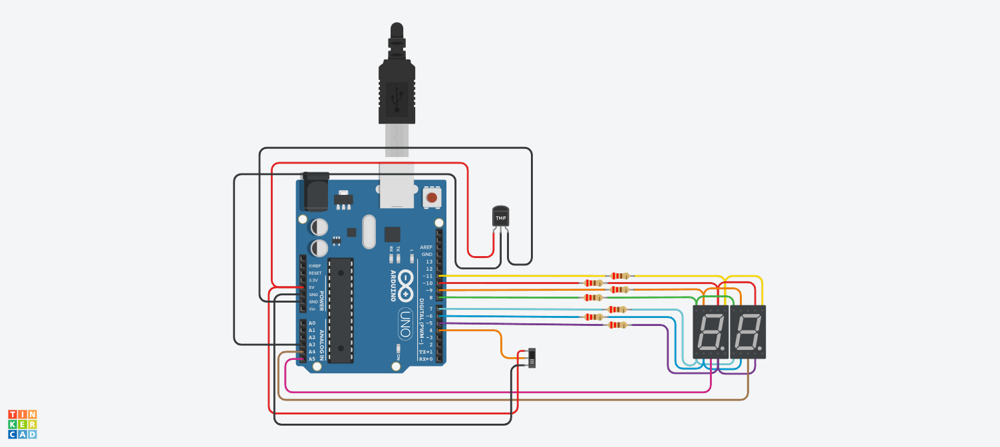

# PARCIAL SPD

## AUTOR 
- FACUNDO VILLOLDO YEGROS 1-B

## Proyecto: Contador binario.

## Descripción
Sustituye uno de los botones por un interruptor deslizante (switch) de dos posiciones.
Dependiendo de la posición del interruptor, el display debe mostrar o bien el contador (como
en la Parte 1) o los números primos en el rango de 0 a 99.

## Función principal
Esta funcion se encarga de identificar los numeros primos. Para mi es la principal ya que tuve que usar otro tipo de función.

~~~C
bool calcularNumeroPrimo(int contador)
{
  for(i=2;i<contador;i++)
  {
    if(contador%i==0 || contador == 9)return(false);
  
  }return true;  
}
~~~

