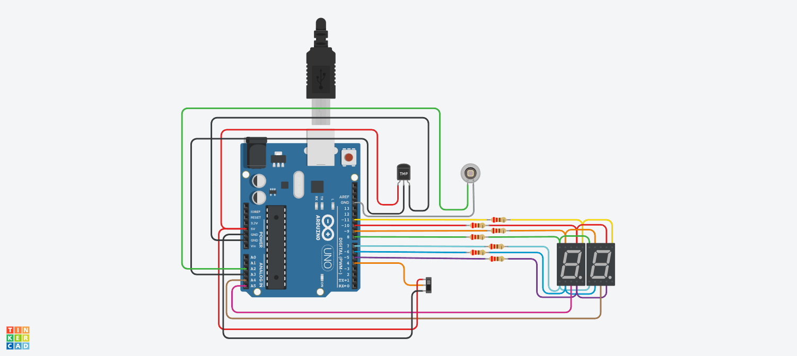

# PARCIAL SPD

## AUTOR 
- FACUNDO VILLOLDO YEGROS 1-B

## Proyecto: Contador binario.

## Descripción

Agregar un conmponente seguún el ultmo numero de DNI. Mi caso agrear un Photodiode.

## Modificación

En mi caso al agregar el Fotodiodo lo utilice para que dependiendo la luz del ambiente se encienda el contador. Esto se puede utilizar por ejemplo para mostrar la hora cuando es de noche o de día.

## Función principal
Esta funcion se encarga de identificar si mostrar numeros primos o usar un contador.

~~~C
void loop()
{
  int luzAmbiental = analogRead(PHOTO);
  Serial.println(luzAmbiental);
  if (luzAmbiental<487)
  {
    botonPrecionado();
    if (estadoSwitch == "primos")
    {
        contadorNumero++;
        if(contadorNumero<99)
        {
          if(calcularNumeroPrimo(contadorNumero)==true && contadorNumero<99)
          {
            mostrarContador(contadorNumero);
            int temperatura=analogRead(TEMP);
            //Serial.println(temperatura);
          }
        }
        else
        {
          contadorNumero = 0;
        }
    }
    else if (estadoSwitch == "contador")
    {
      contadorNumero++;
      if(contadorNumero>99)
        contadorNumero = 0;
      mostrarContador(contadorNumero);
    }
  }
  else
  {
    prendeDigito(APAGADOS);
  }  
}
~~~

