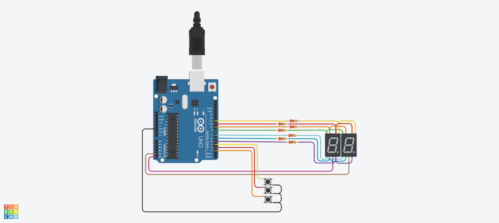

# PARCIAL SPD

## AUTOR 
- FACUNDO VILLOLDO YEGROS 1-B

## Proyecto: Contador binario.

## Descripción
Diseñar un contador de 0 a 99 utilizando dos displays de 7 segmentos y tres botones para
  controlar la cuenta. Debes implementar la técnica de multiplexación para mostrar los dígitos
  en los displays. El contador debe comenzar en 0 y debe ser capaz de aumentar o disminuir
  su valor en una unidad con los botones.

## Función principal
Esta funcion se encarga de encender y apagar los leds, intercalando las unidades con las decenas.

~~~C
void mostrarContador(int contador)
{
  prendeDigito(APAGADOS);
  mostrarNumero(contador/10);
  prendeDigito(UNIDAD);
  prendeDigito(APAGADOS);
  mostrarNumero(contador-10*((int)contador/10));
  prendeDigito(DECENA);
}
~~~

